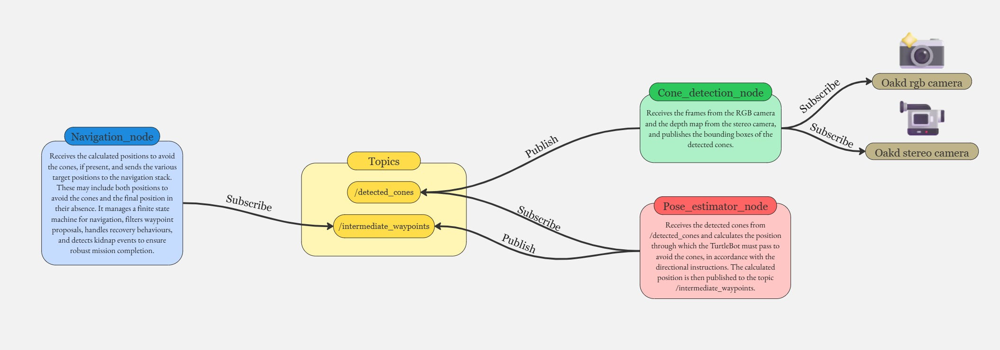
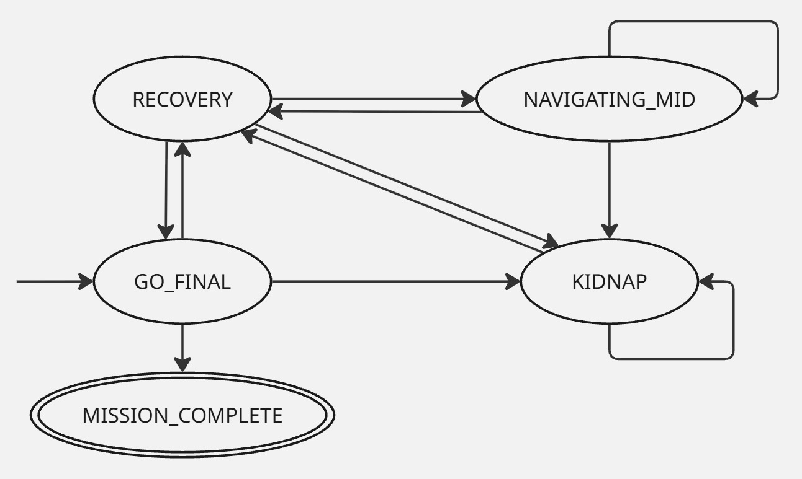

# Design and Implementation of a Cone-Guided Navigation System Using ROS 2 and TurtleBot4 🐢📡

## 🏬 Project Overview
The project implements a **ROS 2-based navigation architecture for a TurtleBot4** tasked with reaching a predefined goal within a known **indoor environment** while respecting **traversal rules imposed by colour-coded cones**. The system computes feasible paths, avoids static and dynamic obstacles, and enforces rules (pass to the left or right of cones depending on their colour). The architecture also includes recovery behaviours for localisation loss (the "**kidnapped robot**" scenario).

---

## 🏛️ ROS 2 architecture overview
The design is modular and reactive, leveraging ROS 2 publish/subscribe for inter-component communication. Perception, pose estimation, planning and high-level supervision are implemented as separate nodes communicating via topics.

- **Communication**: primarily via topics (the navigation stack itself may use services/actions internally).
- **Modularity**: distinct nodes for cone detection, intermediate waypoint estimation and navigation supervision.



### `cone_detection_node.py`
- **Role**: Detect cones in RGB frames and estimate their distance using the stereo/depth stream. Publishes detections for downstream processing.
- **Key implementation points**:
  - Subscribes to `/oakd/rgb/preview/image_raw` (RGB preview) and `/oakd/stereo/image_raw` (depth image).
  - Uses CvBridge to convert ROS Image messages to OpenCV BGR images; resizes RGB to (1280,720) for processing.
  - Detector: Ultralytics YOLOv8 model (the code loads a local model file `cone.pt` by default).
  - Post-processing: filters detections by image region (exclude top/bottom padding), size/aspect-ratio and confidence; computes dominant colour via multi-space analysis and K-means clustering; applies adaptive colour boosting and target enhancement to mitigate lighting variability.
  - Depth estimation: maps RGB centroid to stereo depth image, samples a small ROI (configurable `depth_roi_size`) and returns the median of non-zero depth values (code converts mm→m when necessary).
  - Publishes `nav_interfaces/ConeDetectionArray` on `/detected_cones` and provides an OpenCV visualisation window for debugging.
  - Notes from source: the YOLO model path is hard-coded and the node expects depth encodings `16UC1` or `32FC1`.

### `pose_estimator_node.py`
- **Role**: Convert cone detections into intermediate waypoints (map-frame `PoseStamped`) that respect cone-passing rules.
- **Key implementation points**:
  - Subscribes to `/detected_cones` (`nav_interfaces/ConeDetectionArray`), `/oakd/stereo/camera_info` (for intrinsics) and `/amcl_pose`.
  - On first camera-info reception it stores intrinsics (fx, fy, cx, cy) and then destroys the intrinsics subscription.
  - Behaviour: selects the closest valid cone (filters out cones with depth < 1.2 m or > 3.5 m), searches for an aligned cone of opposite colour to compute a midpoint; if no partner is found it applies a lateral offset to a single cone (offset sign depends on cone colour).
  - Coordinate transforms: projects pixel+depth to 3D camera coordinates using the pinhole model, then uses TF2 to transform points into the `map` frame (uses `oakd_rgb_camera_optical_frame` as the camera frame id).
  - Publishes intermediate waypoints as `geometry_msgs/PoseStamped` on `/intermediate_waypoint`.
  - The node uses conservative TF timeouts and thread locks to protect shared state.

### `navigation_node.py`
- **Role**: High-level supervisor implementing a finite-state controller that drives the robot to the final mission goal while accepting and handling intermediate waypoints.
- **Key implementation points**:
  - Implements an FSM with states: `GO_FINAL`, `RECOVERY`, `NAVIGATING_MID`, `KIDNAP`, `MISSION_COMPLETE`.
  - Subscribes to `/intermediate_waypoint` (`geometry_msgs/PoseStamped`), `/amcl_pose` (`PoseWithCovarianceStamped`) and `/kidnap_status` (`irobot_create_msgs/KidnapStatus`).
  - Uses a `TurtleBot4Navigator` wrapper to interact with the navigation stack (methods expected: `getPoseStamped`, `goToPose`, `setInitialPose`, `cancelTask`, `clearAllCostmaps`, `waitUntilNav2Active`, `spin`, etc.).
  - Reads mission `start` and `goal` from `navigation_config.json` located in the package directory (path present in the source: `src/nav_pkg/nav_pkg/navigation_config.json`).
  - Buffering and filters:
    - Maintains a FIFO buffer of intermediate waypoints; `buffer_limit_max = 12`, `buffer_limit_min = 4`.
    - Filtering/merging parameters include `goal_merge_distance = 0.5` and `outlier_std_threshold = 0.8`.
  - Timing and loop rate: the FSM is executed in a timer callback at 2 Hz (0.5 s period).
  - Kidnap handling: on kidnap detection the node clears waypoints and active navigation tasks, performs controlled rotations to aid relocalisation (align to final goal, then a ~60° sweep), and returns to `RECOVERY`.
  - The navigation node uses thread locks to protect shared data and a multi-threaded executor is used in `main()`.

### 🛠️ Custom message types
There are two custom messages for detection:

- `ConeDetection` — single-cone data (bounding box coordinates, centroid, detected colour, estimated distance).
- `ConeDetectionArray` — array of `ConeDetection` messages for a single frame.

---

## 🔄 Finite State Machine (FSM)

The navigation supervisor implements a **finite state machine** with five primary states:

- `GO_FINAL`: initial state — navigate to the final mission goal.
- `RECOVERY`: handle navigation failures or interruptions.
- `NAVIGATING_MID`: navigate to intermediate waypoints proposed by perception.
- `KIDNAP`: handle kidnapping/localisation-reset events.
- `MISSION_COMPLETE`: final goal reached; perform cleanup and shut down.



**Key transitions (from the report)**:
- `GO_FINAL` → `MISSION_COMPLETE` when the final goal is reached.
- `GO_FINAL` → `RECOVERY` if navigation fails or is cancelled.
- `RECOVERY` → `KIDNAP` when the `/kidnap_status` topic indicates a kidnap event.
- `RECOVERY` → `NAVIGATING_MID` when enough buffered intermediate waypoints are available (buffer limit 12; threshold for detour = 4 proposals).
- After `KIDNAP` the node performs cleanup and controlled rotations (align to goal, then sweep ~60°) before returning to `RECOVERY`.

---

## ⚙️ Installation and start-up
The repository contains helper scripts that automate the typical run sequence. The instructions below assume a Linux/WSL environment with ROS 2 and `colcon` installed.

⚠️ **The system has been implemented and tested on Ubuntu 22.04** ⚠️

1. Clone the repository and enter the workspace:

```bash
git clone <repository-url>
cd Mobile-Robots-For-Critical-Mission-Project/turtlebot4/diem_turtlebot_ws
```

2. Build the workspace:

```bash
colcon build
source install/setup.bash
```

3. Start the ROS 2 navigation stack and related components

To start the navigation stack (localisation, Nav2, RViz, etc.) run the existing helper script `navigation.sh` located in `src/nav_pkg/`. This script executes the required `ros2 launch` commands for the navigation stack.

Run:

```bash
bash src/nav_pkg/navigation.sh
```

4. Launch the project architecture (perception + estimation + supervisor)

To launch the project nodes that implement perception and high-level control, run the provided `nodes.sh` script in `src/nav_pkg/`. This script builds `nav_pkg` (if necessary) and starts the three main nodes (`cone_detection_node`, `pose_estimator_node`, `navigation_node`) in separate terminals.

🚧 **Remember to change the paths** 🚧

Run:

```bash
bash src/nav_pkg/nodes.sh
```

Note: both scripts use `gnome-terminal` and are designed for Linux. If you prefer to run nodes manually, the equivalent `ros2 run` commands are:

```bash
ros2 run nav_pkg cone_detection_node
ros2 run nav_pkg pose_estimator_node
ros2 run nav_pkg navigation_node
```

---

## ❌ Limitations and constraints
- **Hardware instability** on some TurtleBot4 units (camera crashes or lag).
- **Battery and availability constraints** reduced real-world testing time.
- **Adverse lighting and reflective surfaces** can cause missed detections; mismatch between RGB preview and stereo depth resolution required preview reconfiguration and resizing in code.

---
